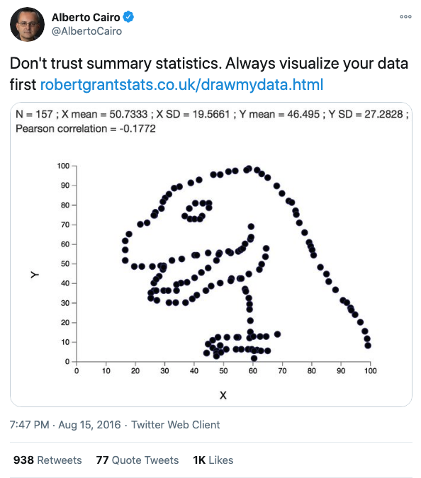

```{r setup, include=FALSE}
knitr::opts_chunk$set(echo = TRUE)
```

## Datasaurus Introduction

I recently came across the **Datasaurus** dataset by Alberto Cairo on [#TidyTuesday](https://github.com/rfordatascience/tidytuesday/blob/master/data/2020/2020-10-13/readme.md) and wanted to create a series of charts illustrating the lessons associated with this dataset, primarily to: [never trust summary statistics alone](http://www.thefunctionalart.com/2016/08/download-datasaurus-never-trust-summary.html).

First, some context. Here's Alberto's [original tweet](https://twitter.com/albertocairo/status/765167969139765250) from years ago when he created this dataset:



This tweet alone doesn't communicate why we shouldn't trust summary statistics alone, so let's unpack this. First we'll load the various packages and data we'll use.

## Load Packages

```{r packages}
library(tidyverse)
library(ggcorrplot)
library(ggridges)
```

## Load Data

**note** : `datasaurus` and `datasaurus_dozen` are identical. The former is provided via #TidyTuesday, the latter from [this research paper](https://www.autodesk.com/research/publications/same-stats-different-graphs) discussing more advanced concepts beyond the scope of this document (i.e., simulated annealing). 

You'll also note that `datasaurus_dozen` and `datasaurus_wide` are the same data, organized differently. The former in *long* format and the latter, in *wide* format - see here for [details](http://www.cookbook-r.com/Manipulating_data/Converting_data_between_wide_and_long_format/).

For the most part, we'll use `datasaurus_dozen` throughout this document. We'll use `datasaurus_wide` when we get to the correlation section. 

```{r data}
datasaurus <- readr::read_csv('https://raw.githubusercontent.com/rfordatascience/tidytuesday/master/data/2020/2020-10-13/datasaurus.csv')
datasaurus_dozen <- read_tsv('DatasaurusDozen.tsv')
datasaurus_wide <- read_tsv('DatasaurusDozen-wide.tsv')
```

## Eyeballing the data

Here are the first six rows of `datasaurus_dozen` (long):

```{r long, echo=FALSE}
head(datasaurus_dozen)
```

Here are the first six rows of `datasaurus_wide` (wide):

```{r wide, echo=FALSE}
head(datasaurus_wide)
```

There are 13 variables, each with X- and Y- axes.

## Summary Statistics

First, we'll note that if we just look at summary statistics (i.e., **mean** and **standard deviation**), we might conclude that these variables are all the *same*. Moreover, within each variable, `x` and `y` values have very **similarly low correlations** at ranging from -0.06 to -0.07.

```{r summary}
datasaurus_dozen %>%
    group_by(dataset) %>%
    summarize(
        x_mean = mean(x),
        x_sd = sd(x),
        y_mean = mean(y),
        y_sd = sd(y),
        corr = cor(x,y)
    )
```

## Boxplots

You could use `boxplots` to show *slight* variation in the distribution and **median** values of these 13 variables. However, the **mean** values, indicated with the red circles, are identical.

```{r boxplot_x}
datasaurus_dozen %>%
    ggplot(aes(x = dataset, y = x, fill = dataset)) +
    geom_boxplot(alpha = 0.6) +
    stat_summary(fun = mean, geom = "point", shape = 20, size = 6, color = "red", fill = "red") +
    scale_fill_brewer(palette = "Set3") +
    theme_classic() +
    theme(legend.position = 'none') +
    labs(
        y = '13 variables',
        x = 'X-values',
        title = "Boxplots: Slight differences in the distribution and median values (X-axis)",
        subtitle = "Identical mean values"
    )
```

Here's the same plot for `y` values:

```{r boxplot_y}
datasaurus_dozen %>%
    ggplot(aes(x = dataset, y = y, fill = dataset)) +
    geom_boxplot(alpha = 0.6) +
    stat_summary(fun = mean, geom = "point", shape = 20, size = 6, color = "red", fill = "red") +
    scale_fill_brewer(palette = "Paired") +
    theme_classic() +
    theme(legend.position = 'none') +
    labs(
        y = '13 variables',
        x = 'Y-values',
        title = "Boxplots: Slight differences in the distribution and median values (Y-axis)",
        subtitle = "Identical mean values"
    )
```

## Ridgeline Plot

We can begin to get a sense for how these variables are different if we plot the distribution in different ways. The ridgeline plot begins to reveal aspects of the data that were hidden before.

We can begin to see that certain variables have markedly different distribution shapes (i.e., `v_lines`, `dots`, `x_shape`, `wide_lines`), while having the same **mean** value.

```{r ridgeline_x}
datasaurus_dozen %>%
    ggplot(aes(x = x, y = dataset, fill = dataset)) +
    geom_density_ridges_gradient(scale = 3, quantile_lines = T, quantile_fun = mean) +
    scale_fill_manual(values = c('#a6cee3', '#1f78b4', '#b2df8a', '#33a02c', '#fb9a99', '#e31a1c', '#fdbf6f', '#ff7f00', '#cab2d6', '#6a3d9a', '#ffff99', '#b15928', 'grey')) +
    theme_classic() +
    theme(legend.position = 'none') +
    labs(
        x = "X-values",
        y = "13 variables",
        title = "Ridgeline Plot: More variation in the distribution (X-axis)",
        subtitle = "Identical mean values"
    )
```

For `y` values, `high_lines`, `dots`, `circle` and `star` have obviously different distributions from the rest. Again, the **mean** values are identical across variables.

```{r ridgeline_y}
datasaurus_dozen %>%
    ggplot(aes(x = y, y = dataset, fill = dataset)) +
    geom_density_ridges_gradient(scale = 3, quantile_lines = T, quantile_fun = mean) +
    scale_fill_manual(values = c('#a6cee3', '#1f78b4', '#b2df8a', '#33a02c', '#fb9a99', '#e31a1c', '#fdbf6f', '#ff7f00', '#cab2d6', '#6a3d9a', '#ffff99', '#b15928', 'grey')) +
    theme_classic() +
    theme(legend.position = 'none') +
    labs(
        x = "Y-values",
        y = "13 variables",
        title = "Ridgeline Plot: More variation in the distribution (Y-axis)",
        subtitle = "Identical mean values"
    )
```

## Correlations

If you skip visualizing the distribution and central tendencies and go straight to seeing how the variables correlate with each other, you could also miss some fundamental differences in the data.

In particular, the `x` and `y` values across all 13 variables are *highlight correlated*. With just knowledge of the summary statistics, one could be led to believe that these variables are *highly similar*. 

Below is an abbreviated **correlation matrix**.

```{r corr_x}
library(ggcorrplot)

# X-values
# selecting rows 2-143 
# turning all values from character to numeric
datasaurus_wide_x <- datasaurus_wide %>%
    slice(2:143) %>%
    select(away, bullseye, circle, dino, dots, h_lines, high_lines, slant_down, slant_up, star, v_lines, wide_lines, x_shape) %>%
    mutate_if(is.character, as.numeric)
    
# Y-values
# selecting rows 2-143 
# turning all values from character to numeric
datasaurus_wide_y <- datasaurus_wide %>%
    slice(2:143) %>%
    select(away_1, bullseye_1, circle_1, dino_1, dots_1, h_lines_1, high_lines_1, slant_down_1, slant_up_1, star_1, v_lines_1, wide_lines_1, x_shape_1) %>%
    mutate_if(is.character, as.numeric)


# correlation matrix for X values
corr_x <- round(cor(datasaurus_wide_x), 1)

# correlation matrix for Y values
corr_y <- round(cor(datasaurus_wide_y), 1)

head(corr_x[, 1:6])
```

### Visualizing the correlation matrix

Here is a correlation between the `x-values` between all 13 variables. You can see that all variables, aside from `away`, are highly correlated with each other. 

```{r corr_x_viz}
# correlation between X-values
ggcorrplot(corr_x, hc.order = TRUE, 
           type="lower", 
           outline.color = "white",
           ggtheme = ggplot2::theme_gray,
           colors = c("#d8b365", "#f5f5f5", "#5ab4ac"),
           lab = TRUE) 
```

Here is a correlation between the 'y-values' between all 13 variables. Again, aside from `away`, all the variables are highly correlated with each other. 

```{r corr_y_viz}
# correlation between Y-values
ggcorrplot(corr_y, hc.order = TRUE, 
           type="lower", 
           outline.color = "white",
           ggtheme = ggplot2::theme_gray,
           colors = c("#ef8a62", "#f7f7f7", "#67a9cf"),
           lab = TRUE)
```

## Facets

At this point, the **boxplots** show us variables with *similar median* and *identical mean*; the **ridgelines** begin to show us that some variables have different distributions. And the **correlation matrix** suggests the variables are more similar than not. 

To really see their differences, we'll need to use `facet_wrap`.

Here we'll use `facet_wrap` to examine the histogram for `x` and `y` values of all 13 variables. We started to see the differences in distribution between variables from the `ridgeline` plots, but overlapping histograms provide another perspective.

```{r facet_histo}
# facet histogram (both-values)
datasaurus_dozen %>%
    group_by(dataset) %>%
    ggplot() +
    geom_histogram(aes(x=x, fill='red'), alpha = 0.5, bins = 30) +
    geom_histogram(aes(x=y, fill='green'), alpha = 0.5, bins = 30) +
    facet_wrap(~dataset) +
    scale_fill_discrete(labels = c('y', 'x')) +
    theme_classic() +
    labs(
        fill = 'Axes',
        x = '',
        y = 'Count',
        title = 'Faceted Histogram: x- and y-values'
    )
```

## Scatter Plot

However, if there's one thing this dataset is trying to communicate its that there's no subtitute for plotting the actual data points. No amount of summary statistics, central tendency or distribution is going to replace **plotting actually data points**. 

Once we create the scatter plot with `geom_point`, we see the big reveal with this dataset. That despite the similarities in central measures, for the most part similar distributions and high correlations, the 13 variables are **wildly different** from each other. 

```{r facet_scatter}
datasaurus_dozen %>%
    group_by(dataset) %>%
    ggplot(aes(x=x, y=y, color=dataset)) +
    geom_point(alpha = 0.5) +
    facet_wrap(~dataset) +
    scale_color_manual(values = c('#a6cee3', '#1f78b4', '#b2df8a', '#33a02c', '#fb9a99', '#e31a1c', '#fdbf6f', '#ff7f00', '#cab2d6', '#6a3d9a', '#ffff99', '#b15928', 'grey')) +
    theme_classic() +
    theme(legend.position = "none") +
    labs(
        x = 'X-axis',
        y = 'Y-axis',
        title = 'Faceted Scatter Plot'
    )
```

There are other less common alternatives to the **scatter plot**.

## Geom Density 2D

While not as clear as the **scatter plot**, plotting the **contours** of a 2D density estimate does show how very different the variables are from each other, despite similar summary statistics. 

```{r geom_density_contour}
# contours of a 2D Density estimate
datasaurus_dozen %>%
    ggplot(aes(x=x, y=y)) +
    geom_density_2d() +
    theme_classic() +
    facet_wrap(~dataset) +
    labs(
        x = 'X-axis',
        y = 'Y-axis',
        title = 'Contours of a 2D density estimate'
    )
```

This is a slight variation using `stat_density_2d`:

```{r stat_density}
# stat density 2d
datasaurus_dozen %>%
    ggplot(aes(x=x, y=y)) +
    stat_density_2d(aes(fill=y), geom = "polygon", colour = 'white') +
    theme_classic() +
    facet_wrap(~dataset) +
    labs(
        x = 'X-axis',
        y = 'Y-axis',
        title = 'Stat Density 2D estimate'
    )
```

Using the `density_2d` plots are quite effective in showing how different the variables are and serve as a nice alternative to the more familiar scatter plot. 

Hopefully this vignette illustrates the importance of never trusting summary statistics (alone). Moreover, when visualizing, we should go beyond simply visualizing the data's distribution or central tendency, but plotting the actually data points. 