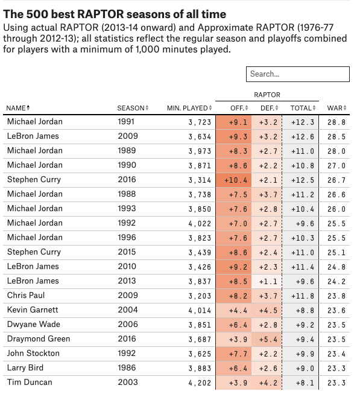

```{r setup, include=FALSE}
knitr::opts_chunk$set(echo = TRUE)
```

## Preparing the Data

We'll start off with the raw data from 538. The data accompanies this Rmarkdown file or, alternatively, can be downloaded directly from their [github repository](https://github.com/fivethirtyeight/data/tree/master/nba-raptor). The file we're using is called 'historical_RAPTOR_by_player.csv'. Background information on the RAPTOR metric can be found [here](https://fivethirtyeight.com/features/how-our-raptor-metric-works/). 

We'll load the libraries, then the raw data.

```{r libraries}
library(tidyverse)
library(reactable)
library(htmltools)

# read data
df <- read_csv("historical_RAPTOR_by_player.csv")
df %>% head()
```

## Objective

Here's what the 538 table looks like (**note**: we'll add an extra column not shown in this picture.) This table features 538's most updated NBA statistic, RAPTOR, which stands for Robust Algorithm (using) Player Tracking (and) On/Off Ratings. 

It attempts to rank indiviual (player's) seasons, rather than individual players *themselves*, because a player's career, like any career, has ebbs and flows. 

Our objective is to re-create this table and give it a fresh makeover. 



## Data Wrangling

We will wrangle the data to be a close to what we need *before* using the `reactable` package. We'll first select the columns we're interested in. Then we'll filter for players who played for more than 1000 minutes (mp), as done in the original. We'll arrange the data in descending order by WAR - wins above replacement. 

Next, we'll rename the columns to match the names used by 538. Then we'll format all columns with decimal numbers to be rounded to one decimal place. Finally, we'll choose the top 100 rows (after filtering) to keep our data manageable.

We'll save this to a variable called `raptor_table`.

```{r raptor_table, echo=TRUE}

raptor_table <- df %>%
    select(player_name, season, mp, raptor_offense, raptor_defense, raptor_total, war_total, war_playoffs) %>%
    filter(mp > 1000) %>%
    arrange(desc(war_total)) %>%
    rename(
        NAME = player_name,
        SEASON = season,
        MIN_PLAYED = mp,
        OFF = raptor_offense,
        DEF = raptor_defense,
        TOTAL = raptor_total,
        WAR = war_total,
        PLAYOFF_WAR = war_playoffs
    ) %>%
    mutate_at(4:8, funs(round(., 1))) %>% 
    head(100) 
```

## Major Structure and Columns

First, we'll wrap our `raptor_table` within the `reactable()` function, which is the reactable package with many parameters for styling and customization, as we'll explore. You'll note in the original table that OFF, DEF and TOTAL are *grouped* under RAPTOR. We'll add this structure to the table heading first. 

```{r major}
reactable(
    raptor_table,
    columns = list(
        OFF = colDef(name = "OFF."),
        DEF = colDef(name = "DEF."),
        TOTAL = colDef(name = "TOTAL")
    ),
    columnGroups = list(
        colGroup(name = "RAPTOR", columns = c("OFF", "DEF", "TOTAL"))
    )
)
```

## Major Table Structural Details

Next, we'll add prominent structural details including table height, mininum rows (10) and making it compact. In addition, we'll enable the sort icon, `showSortIcon`, when any column name is clicked. 

We *won't* disable pagination because that will over write our `column grouping` (i.e., RAPTOR).

```{r features}

reactable(
    raptor_table,
    height = 600,
    minRows = 10,
    showSortIcon = TRUE,
    compact = TRUE,
    pagination = TRUE,
    showPageInfo = TRUE,
    columns = list(
        OFF = colDef(name = "OFF."),
        DEF = colDef(name = "DEF."),
        TOTAL = colDef(name = "TOTAL")
    ),
    columnGroups = list(
        colGroup(name = "RAPTOR", columns = c("OFF", "DEF", "TOTAL"))
    )
)
```

## Add Search Box

Next, we'll add a search box, `searchable`, as well as placeholder text for readability (`langauge`). You can type in a fake name in the search box and if there are no matches, the text will render "No matches". 

```{r search}

reactable(
    raptor_table,
    height = 600,
    minRows = 10,
    showSortIcon = TRUE,
    compact = TRUE,
    pagination = TRUE,
    showPageInfo = TRUE,
    searchable = TRUE,
    language = reactableLang(searchPlaceholder = "Search...", noData = "No matches"),
    columns = list(
        OFF = colDef(name = "OFF."),
        DEF = colDef(name = "DEF."),
        TOTAL = colDef(name = "TOTAL")
    ),
    columnGroups = list(
        colGroup(name = "RAPTOR", columns = c("OFF", "DEF", "TOTAL"))
    )
)
```

## Format Individual Columns

Now we'll add some formatting and styling to each of the individual columns. This will include **column width** and **font** used within the columns. The bulk of this process will be within the `columns` parameter. In addition to the `OFF`, `DEF` and `TOTAL` columns, we'll add formating for the rest of the columns. 

This includes customizing name, customizing digits (i.e., making sure commas are placed for minutes played), font and font sizes. 

We'll also add a "+" prefix for the `TOTAL` column. Althought we had previously formatted our data to one decimal place, we'll need to explicitly re-state with `format = colFormat(digits = 1)` to make sure all digits line up properly. You'll note that the `style` for `PLAYOFF_WAR` has a `whiteSpace` parameter set to pre - this will be apparent why when we add visuals to this particular column below.

We will style `OFF`, `DEF` and `TOTAL` separately in the next section.

```{r columns}

reactable(
    raptor_table,
    height = 600,
    minRows = 10,
    showSortIcon = TRUE,
    compact = TRUE,
    pagination = TRUE,
    showPageInfo = TRUE,
    searchable = TRUE,
    language = reactableLang(searchPlaceholder = "Search...", noData = "No matches"),
    columns = list(
        NAME = colDef(minWidth = 120, style = list(fontFamily = "liberation mono", fontSize = 14)),
        SEASON = colDef(minWidth = 60, style = list(fontFamily = "liberation mono", fontSize = 14), align = "left"),
        MIN_PLAYED = colDef(name = 'MIN. PLAYED', format = colFormat(separators = TRUE), minWidth = 60, style = list(fontFamily = "liberation mono", fontSize = 14), align = 'right'),
        OFF = colDef(name = "OFF.", format = colFormat(digits = 1), minWidth = 60, align = 'right'),
        DEF = colDef(name = "DEF.", format = colFormat(digits = 1), minWidth = 60, align = 'right'),
        TOTAL = colDef(name = "TOTAL", format = colFormat(prefix = "+", digits = 1), minWidth = 60, align = 'right'),
        WAR = colDef(format = colFormat(digits = 1), minWidth = 60, style = list(fontFamily = "liberation mono", fontSize = 14), align = "right"),
        PLAYOFF_WAR = colDef(name = "P/O WAR", format = colFormat(digits = 1), minWidth = 100, align = 'center', style = list(fontFamily = "liberation mono", whiteSpace = "pre", fontSize = 14))
    ),
    columnGroups = list(
        colGroup(name = "RAPTOR", columns = c("OFF", "DEF", "TOTAL"))
    )
)
```

## Code Edit

Let's pause to make the code more readable by adding comments to better structure the code. 

```{r edit}

reactable(
    # data
    raptor_table,
    # styling for entire table
    height = 600,
    minRows = 10,
    showSortIcon = TRUE,
    compact = TRUE,
    pagination = TRUE,
    showPageInfo = TRUE,
    searchable = TRUE,
    language = reactableLang(searchPlaceholder = "Search...", 
                             noData = "No matches"),
    # styling individual columns
    # columns start
    columns = list(
        NAME = colDef(minWidth = 120, 
                      style = list(fontFamily = "liberation mono", 
                                   fontSize = 14)),
        SEASON = colDef(minWidth = 60, 
                        align = "left",
                        style = list(fontFamily = "liberation mono", 
                                     fontSize = 14)), 
        MIN_PLAYED = colDef(name = 'MIN. PLAYED', 
                            minWidth = 60, 
                            align = 'right',
                            format = colFormat(separators = TRUE), 
                            style = list(fontFamily = "liberation mono", 
                                         fontSize = 14)), 
        OFF = colDef(name = "OFF.", 
                     minWidth = 60, 
                     align = 'right',
                     format = colFormat(digits = 1)), 
        DEF = colDef(name = "DEF.", 
                      minWidth = 60, 
                     align = 'right',
                     format = colFormat(digits = 1)), 
        TOTAL = colDef(name = "TOTAL", 
                       minWidth = 60, 
                       align = 'right',
                       format = colFormat(prefix = "+", 
                                          digits = 1),
                       style = list(fontFamily = "liberation mono", 
                                         fontSize = 14)), 
        WAR = colDef(minWidth = 60, 
                     align = "right",
                     format = colFormat(digits = 1), 
                     style = list(fontFamily = "liberation mono", 
                                  fontSize = 14)), 
        PLAYOFF_WAR = colDef(name = "P/O WAR", 
                             minWidth = 100, align = 'center', 
                             format = colFormat(digits = 1), 
                             style = list(fontFamily = "liberation mono", 
                                          whiteSpace = "pre", 
                                          fontSize = 14))
    ), #columns end
    # grouping OFF,DEF,TOTAL under RAPTOR
    columnGroups = list(
        colGroup(name = "RAPTOR", 
                 columns = c("OFF", "DEF", "TOTAL"))
    )
)
```

## Add Color for OFF, DEF & TOTAL

We'll visualize differences in offensive (OFF) and defensive (DEF) ratings for each NBA player for the regular season and playoffs. 

```{r color}

# note: For contrast, we use two colors shade (blue & red).
# this function
color_palette <- function(x) rgb(colorRamp(c("#edfeff", "#ff2c0f"))(x), maxColorValue = 255)

# Now we'll add color to the OFF and DEF columns


reactable(
    # data
    raptor_table,
    # styling for entire table
    height = 600,
    minRows = 10,
    showSortIcon = TRUE,
    compact = TRUE,
    pagination = TRUE,
    showPageInfo = TRUE,
    searchable = TRUE,
    language = reactableLang(searchPlaceholder = "Search...", 
                             noData = "No matches"),
    # styling individual columns
    # columns start
    columns = list(
        NAME = colDef(minWidth = 120, 
                      style = list(fontFamily = "liberation mono", 
                                   fontSize = 14)),
        SEASON = colDef(minWidth = 60, 
                        align = "left",
                        style = list(fontFamily = "liberation mono", 
                                     fontSize = 14)), 
        MIN_PLAYED = colDef(name = 'MIN. PLAYED', 
                            minWidth = 60, 
                            align = 'right',
                            format = colFormat(separators = TRUE), 
                            style = list(fontFamily = "liberation mono", 
                                         fontSize = 14)), 
        OFF = colDef(name = "OFF.", 
                     minWidth = 60, 
                     align = 'right',
                     format = colFormat(digits = 1),
                     style = function(value){
                         # normalization is based on a cell's value in relation to the range of values in the column
                         normalized <- (value - min(raptor_table$OFF)) / (max(raptor_table$OFF) - min(raptor_table$OFF))
                         color <- color_palette(normalized)
                         # with color set based on the color_palette function, we can feed it to the background parameter
                         list(background = color, fontWeight = "bold", 
                              fontFamily = "liberation mono",
                              fontSize = 14)
                     }
        ), 
        DEF = colDef(name = "DEF.", 
                      minWidth = 60, 
                     align = 'right',
                     format = colFormat(digits = 1),
                     style = function(value){
                         # normalization is based on a cell's value in relation to the range of values in the column
                         normalized <- (value - min(raptor_table$DEF)) / (max(raptor_table$DEF) - min(raptor_table$DEF))
                         color <- color_palette(normalized)
                         # with color set based on the color_palette function, we can feed it to the background parameter
                         list(background = color, fontWeight = "bold", 
                              fontFamily = "liberation mono",
                              fontSize = 14)
                     }
        ), 
        TOTAL = colDef(name = "TOTAL", 
                       minWidth = 60, 
                       align = 'right',
                       format = colFormat(prefix = "+", 
                                          digits = 1),
                       style = list(backgroundColor = '#F5F5F5',
                                    fontFamily = "liberation mono", 
                                    fontSize = 14)), 
        WAR = colDef(minWidth = 60, 
                     align = "right",
                     format = colFormat(digits = 1), 
                     style = list(fontFamily = "liberation mono", 
                                  fontSize = 14)), 
        PLAYOFF_WAR = colDef(name = "P/O WAR", 
                             minWidth = 100, align = 'center', 
                             format = colFormat(digits = 1), 
                             style = list(fontFamily = "liberation mono", 
                                          whiteSpace = "pre", 
                                          fontSize = 14))
    ), #columns end
    # grouping OFF,DEF,TOTAL under RAPTOR
    columnGroups = list(
        colGroup(name = "RAPTOR", 
                 columns = c("OFF", "DEF", "TOTAL"))
    )
)


```

## Add Bars to P/O WAR

Now we'll style the `P/O WAR` column to contrast with WAR, which includes regular season and playoffs. Basketball is nearly a completely different game between the regular season and playoffs, so it's worth knowing wins above replacement from the playoffs, *only* to see which NBA star takes their game up another level during the playoffs. 

```{r bars}

# define a function to define the attributes of bar charts
bar_chart <- function(label, width = "100%", height = "14px", fill = "#00bfc4", background = NULL) {
    bar <- div(style = list(background = fill, width = width, height = height))
    chart <- div(style = list(flexGrow = 1, marginLeft = "6px", background = background), bar)
    div(style = list(display = "flex", alignItems = "center"), label, chart)
}


reactable(
    # data
    raptor_table,
    # styling for entire table
    height = 600,
    minRows = 10,
    showSortIcon = TRUE,
    compact = TRUE,
    pagination = TRUE,
    showPageInfo = TRUE,
    searchable = TRUE,
    language = reactableLang(searchPlaceholder = "Search...", 
                             noData = "No matches"),
    # styling individual columns
    # columns start
    columns = list(
        NAME = colDef(minWidth = 120, 
                      style = list(fontFamily = "liberation mono", 
                                   fontSize = 14)),
        SEASON = colDef(minWidth = 60, 
                        align = "left",
                        style = list(fontFamily = "liberation mono", 
                                     fontSize = 14)), 
        MIN_PLAYED = colDef(name = 'MIN. PLAYED', 
                            minWidth = 60, 
                            align = 'right',
                            format = colFormat(separators = TRUE), 
                            style = list(fontFamily = "liberation mono", 
                                         fontSize = 14)), 
        OFF = colDef(name = "OFF.", 
                     minWidth = 60, 
                     align = 'right',
                     format = colFormat(digits = 1),
                     style = function(value){
                         # normalization is based on a cell's value in relation to the range of values in the column
                         normalized <- (value - min(raptor_table$OFF)) / (max(raptor_table$OFF) - min(raptor_table$OFF))
                         color <- color_palette(normalized)
                         # with color set based on the color_palette function, we can feed it to the background parameter
                         list(background = color, fontWeight = "bold", 
                              fontFamily = "liberation mono",
                              fontSize = 14)
                     }
        ), 
        DEF = colDef(name = "DEF.", 
                      minWidth = 60, 
                     align = 'right',
                     format = colFormat(digits = 1),
                     style = function(value){
                         # normalization is based on a cell's value in relation to the range of values in the column
                         normalized <- (value - min(raptor_table$DEF)) / (max(raptor_table$DEF) - min(raptor_table$DEF))
                         color <- color_palette(normalized)
                         # with color set based on the color_palette function, we can feed it to the background parameter
                         list(background = color, fontWeight = "bold", 
                              fontFamily = "liberation mono",
                              fontSize = 14)
                     }
        ), 
        TOTAL = colDef(name = "TOTAL", 
                       minWidth = 60, 
                       align = 'right',
                       format = colFormat(prefix = "+", 
                                          digits = 1), 
                       style = list(backgroundColor = '#F5F5F5',
                                    fontFamily = "liberation mono", 
                                    fontSize = 14)), 
        WAR = colDef(minWidth = 60, 
                     align = "right",
                     format = colFormat(digits = 1), 
                     style = list(fontFamily = "liberation mono", 
                                  fontSize = 14)), 
        PLAYOFF_WAR = colDef(name = "P/O WAR", 
                             minWidth = 100, 
                             align = 'center', 
                             format = colFormat(digits = 1), 
                             style = list(fontFamily = "liberation mono", 
                                          whiteSpace = "pre", 
                                          fontSize = 14),
                             # render bar chart
                             cell = function(value){
                                width <- paste0(value * 100 / max(raptor_table$PLAYOFF_WAR), "%")
                                value <- format(value, width = 9, justify = "right")
                                bar_chart(value, width = width, fill = "#3fc1c9")
                             }
        )
    ), #columns end
    # grouping OFF,DEF,TOTAL under RAPTOR
    columnGroups = list(
        colGroup(name = "RAPTOR", 
                 columns = c("OFF", "DEF", "TOTAL"))
    )
)

```

## Table Header Styling

We're putting the finishing touches on this table. We'll change all column header font to "liberation mono" and we'll set the
`defaultPageSize` to 15. 

```{r header}

reactable(
    # data
    raptor_table,
    # header styling
    defaultColDef = colDef(headerStyle = list(fontFamily = "liberation mono", fontSize = 16)),
    # styling for entire table
    height = 600,
    minRows = 10,
    showSortIcon = TRUE,
    compact = TRUE,
    pagination = TRUE,
    showPageInfo = TRUE,
    searchable = TRUE,
    language = reactableLang(searchPlaceholder = "Search...", 
                             noData = "No matches"),
    # styling individual columns
    # columns start
    columns = list(
        NAME = colDef(minWidth = 120, 
                      style = list(fontFamily = "liberation mono", 
                                   fontSize = 14)),
        SEASON = colDef(minWidth = 60, 
                        align = "left",
                        style = list(fontFamily = "liberation mono", 
                                     fontSize = 14)), 
        MIN_PLAYED = colDef(name = 'MIN. PLAYED', 
                            minWidth = 60, 
                            align = 'right',
                            format = colFormat(separators = TRUE), 
                            style = list(fontFamily = "liberation mono", 
                                         fontSize = 14)), 
        OFF = colDef(name = "OFF.", 
                     minWidth = 60, 
                     align = 'right',
                     format = colFormat(digits = 1),
                     style = function(value){
                         # normalization is based on a cell's value in relation to the range of values in the column
                         normalized <- (value - min(raptor_table$OFF)) / (max(raptor_table$OFF) - min(raptor_table$OFF))
                         color <- color_palette(normalized)
                         # with color set based on the color_palette function, we can feed it to the background parameter
                         list(background = color, fontWeight = "bold", 
                              fontFamily = "liberation mono",
                              fontSize = 14)
                     }
        ), 
        DEF = colDef(name = "DEF.", 
                      minWidth = 60, 
                     align = 'right',
                     format = colFormat(digits = 1),
                     style = function(value){
                         # normalization is based on a cell's value in relation to the range of values in the column
                         normalized <- (value - min(raptor_table$DEF)) / (max(raptor_table$DEF) - min(raptor_table$DEF))
                         color <- color_palette(normalized)
                         # with color set based on the color_palette function, we can feed it to the background parameter
                         list(background = color, fontWeight = "bold", 
                              fontFamily = "liberation mono",
                              fontSize = 14)
                     }
        ), 
        TOTAL = colDef(name = "TOTAL", 
                       minWidth = 60, 
                       align = 'right',
                       format = colFormat(prefix = "+", 
                                          digits = 1),
                       style = list(backgroundColor = '#F5F5F5',
                                    fontFamily = "liberation mono", 
                                    fontSize = 14)), 
        WAR = colDef(minWidth = 60, 
                     align = "right",
                     format = colFormat(digits = 1), 
                     style = list(fontFamily = "liberation mono", 
                                  fontSize = 14)), 
        PLAYOFF_WAR = colDef(name = "P/O WAR", 
                             minWidth = 100, 
                             align = 'center', 
                             format = colFormat(digits = 1), 
                             style = list(fontFamily = "liberation mono", 
                                          whiteSpace = "pre", 
                                          fontSize = 14),
                             # render bar chart
                             cell = function(value){
                                width <- paste0(value * 100 / max(raptor_table$PLAYOFF_WAR), "%")
                                value <- format(value, width = 9, justify = "right")
                                bar_chart(value, width = width, fill = "#3fc1c9")
                             }
        )
    ), #columns end
    # grouping OFF,DEF,TOTAL under RAPTOR
    columnGroups = list(
        colGroup(name = "RAPTOR", 
                 columns = c("OFF", "DEF", "TOTAL"),
                 headerStyle = list(fontFamily = "liberation mono", fontSize = 16))
    ),
    defaultPageSize = 15
)
```
